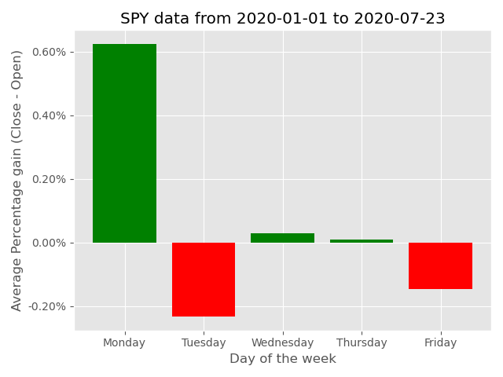
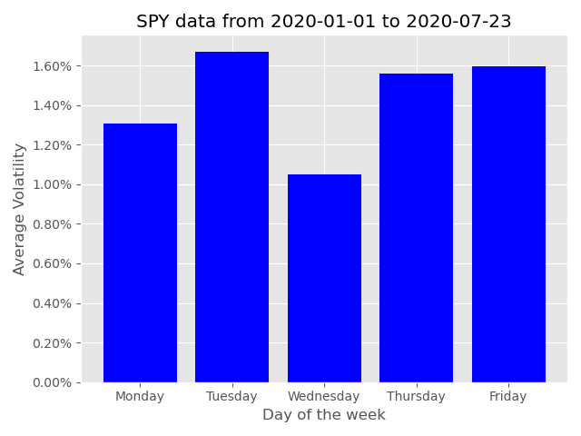
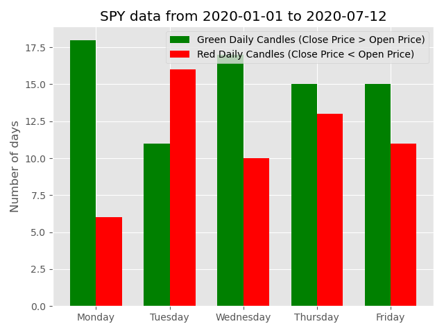

#  Stock Market Daily Data

This program displays the average historical percentage gain (Daily Close Price - Daily Open Price) and volatility of the stock (Calculated with Standard Deviation of the average daily percentage gain) based on the day of week. It also display the historical best and worst days for a certain stock based on the daily price candle. If the price closed higher than it opened, the daily candle is considered green. If the price closed lower than it opened, the daily candle is considered red. This program display the distribution of historical daily candles based on different days of the week as a bar chart.

### Example:
This is an example of displaying SPY data from Jan 1, 2020 to Jul 12, 2020

