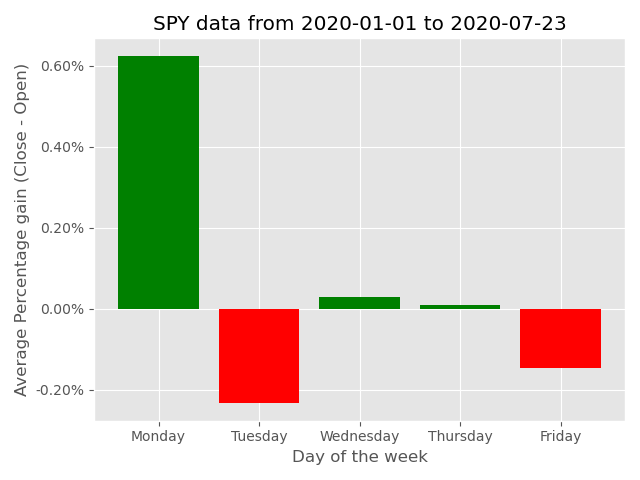
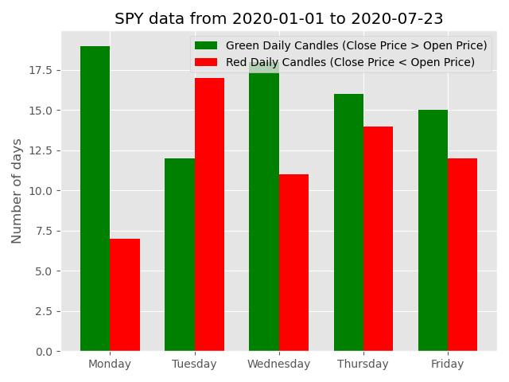
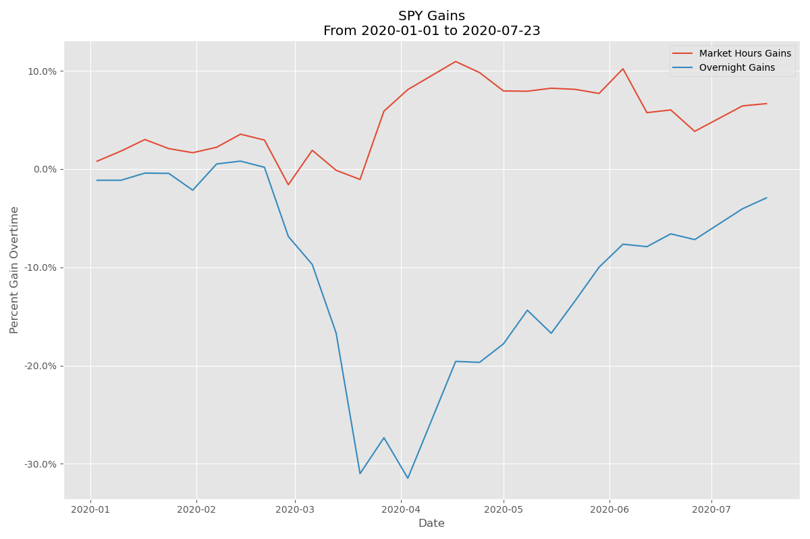
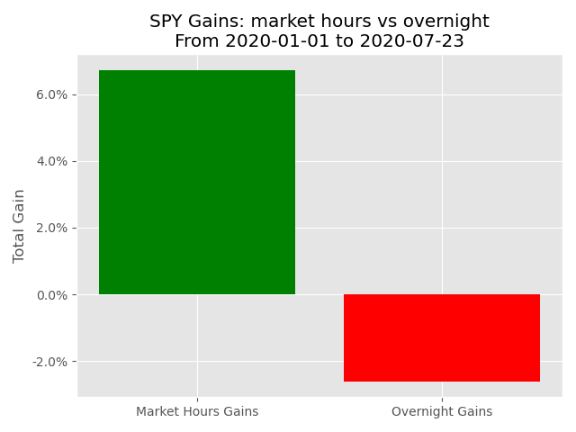

#  Stock Market Data

This program displays the average historical percentage gain (Daily Close Price - Daily Open Price) based on the day of week. It also display the historical best and worst days for a certain stock based on the daily price candle, if the price closed higher than it opened on a specific day, the daily candle is considered green. If the price closed lower than it opened on a specific day, the daily candle is considered red. This program display the distribution of historical daily candles based on different days of the week as a bar chart.
Moreover, this program also compares gains/losses made during market hours to gains/losses made overnight (outside market hours). 
### Example:
This is an example of displaying SPY data from Jan 1, 2020 to Jul 12, 2020

